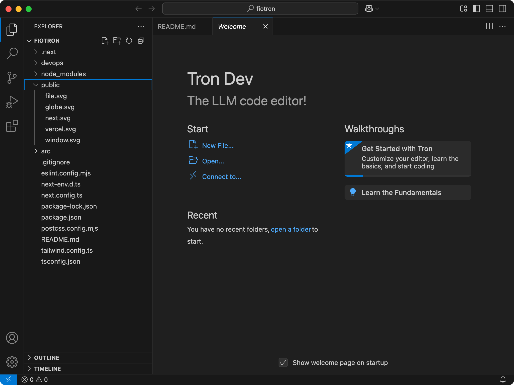
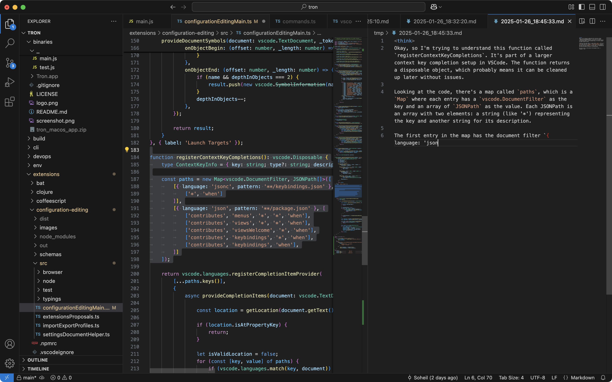

     
    
    <h1>Tron</h1>
    <h3>The LLM code editor with DeepSeek-R1 support</h3>

## Download/Install

:tada: :tada:
Download latest release here:
[Tron](https://github.com/soheil/tron/releases)
:tada: :tada:

> Drag `Tron.app` to your Applications folder then right click Open and click on Open in the dialog box

## License

[MIT](https://github.com/soheil/tron/blob/master/LICENSE)
